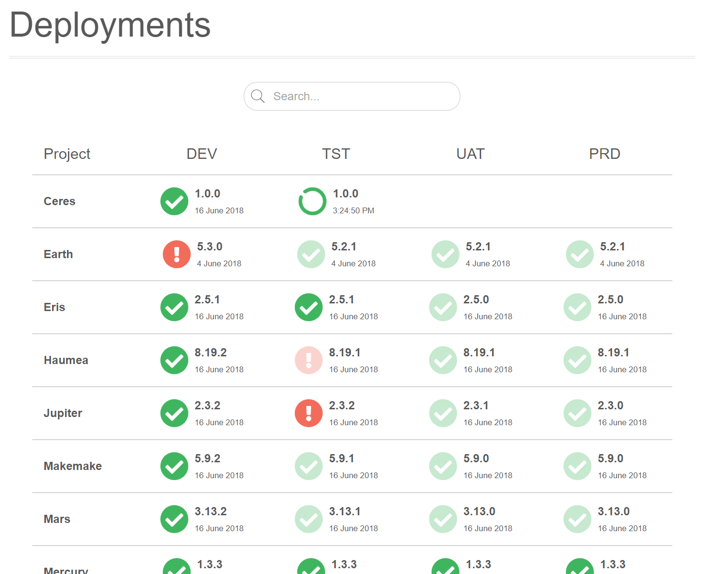
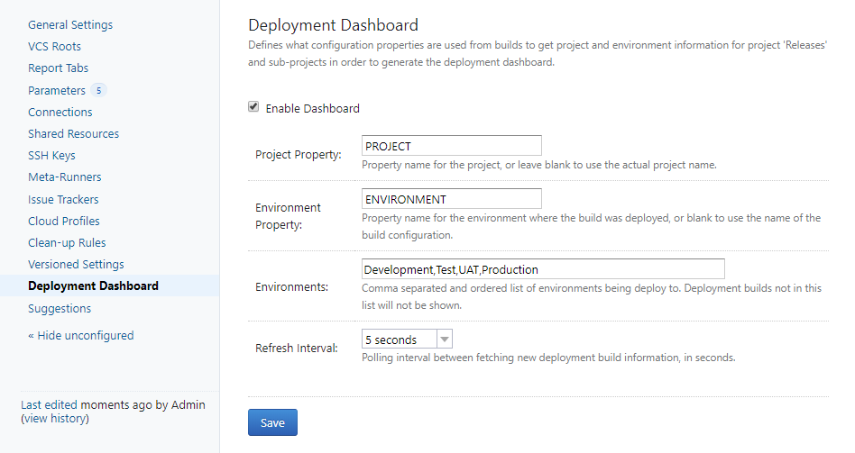

TeamCity Deployment Dashboard
=============================

A TeamCity plugin that shows a high level view of what builds have been deployed into what
environments across multiple projects.

Features
--------

* Shows deployments for the current project and all sub-projects, and can be configured at any
level to show different environments.
* Visualises deployment result, showing success, error, in progress, or a delayed build.
* Shows deployment time or the date if not today.
* Links deployments visualisation to the original build.
* Project, version and environment values can be taken from a related concept in TeamCity
(project name, build name, build number) or by using a value of a property[1](#f1).
* Resolves properties used in project/version/environment. For example, using a build number
from a build stage (via snapshot-dependency) to show appropriate version at deployment.
* Optional property display to show custom information on the deployment such as the branch used.
* Optional deep build history search to find different environments deployed by a single
build configuration.
* Highlights the latest version to emphasise build journey to production (assumes
semver-formatted version string).
* Real-time search to quickly narrow large numbers of projects.
* Auto-refresh capability with configurable polling period.
* Pretty. :)

Example
-------

Getting Started
---------------

1. Install the plugin via the TeamCity Plugin Portal.
2. Restart TeamCity as prompted.
3. Enable plugin in project configuration, listed as a new entry in the sidebar "Deployment Dashboard".

Once enabled, a new "Deployments" project tab will appear on deployment builds showing the dashboard
content, and all sub-projects.

A deployment build in TeamCity can be selected from the build configuration's "General" tab. This
changes a build's "Run" button to "Deploy" and lists it on the build overview.

Environments
------------

TeamCity does not have (or probably need), the notion of a deployment environment. However, the
dashboard needs to be able to correlate build configurations (and the deployment builds that are
created) with an environment so it can be placed in the relevant part of the dashboard.

The deployment dashboard classifies a build deployments as part of a particular environment,
either by a build variable[1](#f1) or by the name of the build configuration (though the
latter is arguably less useful being more likely to be an action such as "Deploy Dev").

Configuration
-------------

Enabling the plugin in the configuration will show three settings.

1. Project Property: This is used to customise the project name shown in the dashboard and can be used
in the case where the name of the immediate project is not appropriate. If the project name works,
leave  this blank, otherwise the dashboard will be picked up from the build property[1](#f1)
named by this key.
2. Version Property: This signifies the build property[1](#f1) that indicates the
semver-formatted version string, e.g. 1.2.3 or 1.2.3+45 with a build number. See Versioning of
Builds section below.
3. Environment key: This signifies the build property[1](#f1) that indicates the
environment name, e.g. Dev, UAT.
4. Environments: This lists all the possible environments, and will determine the columns shown on
the dashboard. If the environment of the build is not in this list, it will not appear on the
dashboard.
5. Custom Property: This allows showing custom information with each deployment such as the branch
that was used to build. This can be left blank if not required.
6. Refresh Interval: Enables a background-poll of deployments to allow showing on unattended
build screens.
7. Build Scanning (Multi-Environment Build Configurations): This option activates a deeper search
of the build history. Enable if deploying to multiple environments from the same build configuration.

Projects inherit parent configuration unless overridden at a lower level. If all projects in a 
TeamCity instance are the same, the configuration only needs to be set in the root project.

TeamCity Project Configuration Scenarios
----------------------------------------

Here are some ideas to help support different build configurations.

**Environments Separated by the TeamCity Build Chain**

A natural way to set up TeamCity is to split deployments into environments by using separate
build configurations and link them using snapshot dependencies so that they can be represented
on a pipeline (or 'build chain' in TeamCity parlance). Build variables[1](#f1)
can be set on each deployment stage to indicate the environment to the dashboard.

**Single Build Configuration that can be Deployed to Multiple Environments**

The environment to deploy to is determined by more than just the build configuration.
Perhaps the environment is determined by the agent, or the user is prompted at deploy time.

When using a single build configuration, the `Multi-Environment Build Configurations` option
should be enabled in order to more deeply search the build history as by default the plugin
only fetches the last deployment for a build configuration for efficiency reasons.

**Composite Environment Information**

Some environments consist of multiple deployment locations, such as deploying to different cloud
regions. One way of visualising such multi-region deployments is to define a new composite
parameter that combines environment and region. For example, DEV and PRD in region EUR and USA
could be done by defining a parameter with a value like `%environment%-%region%`. Once the plugin
has been configured to use this new parameter as the environment key, the environment list of
deploys to show would then be `DEV-EUR,DEV-USA,DEV-EUR,PRD-USA`.

**Custom Deployment Information**

Sometimes it is useful to display other information with each deployment, such as the branch
used to build. The Custom Property feature can be used to for this, e.g. setting it to
`teamcity.build.branch`.

Multiple pieces of information can be displayed as the custom information by creating a new
property that concatenates different pieces of information and referencing that property.
Dynamic information constructed programmatically in the build steps can also be provided by
using TeamCity service messages.

If the information is too long for the field it will be truncated, but the full information can
be displayed by hovering over it.

Scaling to Multiple Teams with the Project Hierarchy
----------------------------------------------------

The dashboard shows deployments for the current project and all sub-projects. This allows the 
greatest visibility at the higher levels. However, it can be hard to find consistency of
environment names between multiple teams and what properties in TeamCity they use to classify them.

There are two ways to handle this:

1. Only enable the dashboard at lower levels of the project hierarchy. Ideally teams would have 
their own configuration branch in TeamCity where it is much easier to make deployment builds 
consistent.
2. Only define the environments that all teams can agree on at the top levels of the project 
hierarchy, such as Development, UAT and Production. Then override the dashboard configuration 
at lower levels to be more specific. A team that has an additional performance testing 
environment can then see all their deployments, the additional environment just won't be shown 
at the top level.

Versioning of Builds
--------------------

By default, the dashboard will show the TeamCity build number as the version. This can be
customised using [TeamCity Service Messages](https://www.jetbrains.com/help/teamcity/build-script-interaction-with-teamcity.html#BuildScriptInteractionwithTeamCity-ReportingBuildNumber).
Alternatively a property can be used that references the original build in a TeamCity build
chain, for example a `VERSION` property set to `%dep.Project_Build.version%+%dep.Project_Build.build.counter%`.

This actual value be any formatted version string, but in order to visualise the journey of the build
through environments the dashboard interprets the version number to work out which is the latest
build and de-emphasises any deployments that are not. This is why in the screenshot above the
older builds are slightly faded, to keep emphasis on a new build moving towards production.

The format supported is standard [SemVer 2](https://semver.org). For example `1.2.3` or `1.2.3+45`
if a build number is required.

If the TeamCity build number is being used for other purposes, or it contains other information,
the `Version Property` in the plugin configuration can be used for plugin use instead.

Deployment Visibility
---------------------

Builds in TeamCity will be performed for many reasons and not all of them will be relevant to 
show on the dashboard. This plugin will only show builds if the following are true:

1. The build configuration type set to `Deployment` and therefore has a 'Deploy' button rather 
than 'Run'
   * See: TeamCity / Project Configuration / Build configuration type
2. Has a property[1](#f1) matching the project key when not blank.
3. Has a property[1](#f1) that matches the environment key when not blank.
4. The environment deployed to is contained in the list of configured environments.
5. It is the most recent non-cancelled build for that build configuration, or...
6. When `Multi-Environment Build Configuration` is set, the plugin gives up trying to find
a deployment for a configured environment after 1000 entries in the history.

Implementation
--------------

This project is written in JavaScript with React for the frontend, and Kotlin for the backend.
The backend manages configuration, queries the build data, and provides a REST endpoint to
provide the React frontend with the required deployment and configuration data.

Building
--------

The easiest way to build the project is to:
  1. Run `build.sh` from the root directory (only Docker required)
  2. Copy the resulting `deployment-dashboard.zip` file to `<TeamCityData>/plugins/`
  3. Reload the plugin from TeamCity the Plugin List or restart it

If there is an error running `build.sh` such as `Cannot autolaunch D-Bus without X11 $DISPLAY`
remove `DOCKER_BUILDKIT=1` from this script the first time it's run.

While this method is fairly simple, it's quite slow even after the first run because
Gradle has a very cold start when run from a Docker image, and has to download
dependencies on every build. PRs to force Gradle to make better use the Docker cache
very welcome!

A much quicker build cycle is to install NPM and Gradle locally, and do the
equivalent of the Dockerfile instructions on the host. This makes builds run in
seconds rather than minutes.

Notes
-----

<a name="f1">1</a>: Build variables are defined using the normal TeamCity convention for addressing
build variables, and can be a configuration parameter (no prefix), environment variable (prefix of
'env.') or system property with prefix of 'system.'.
